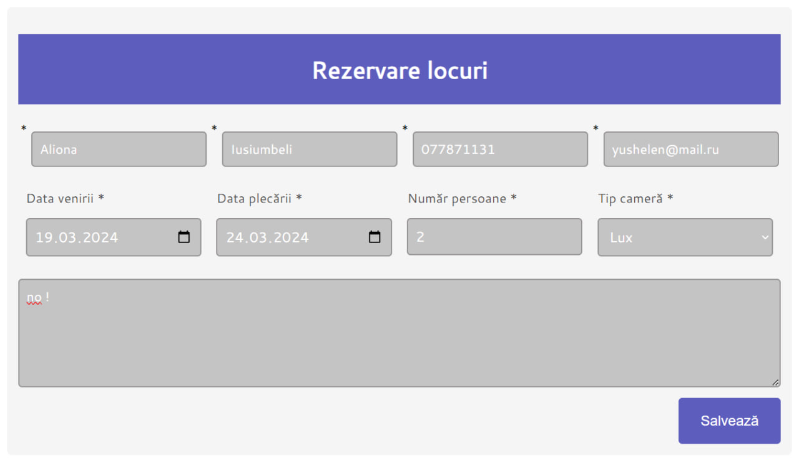
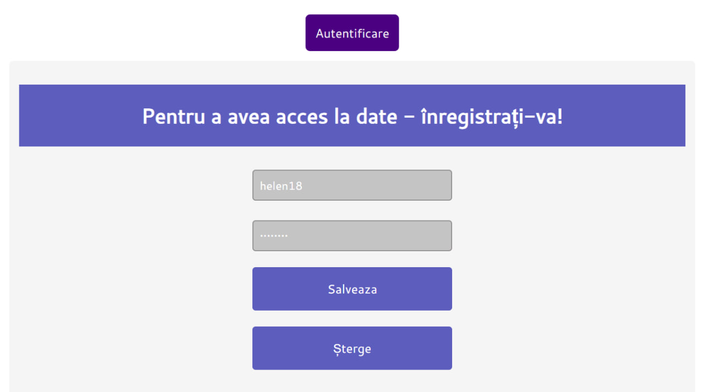
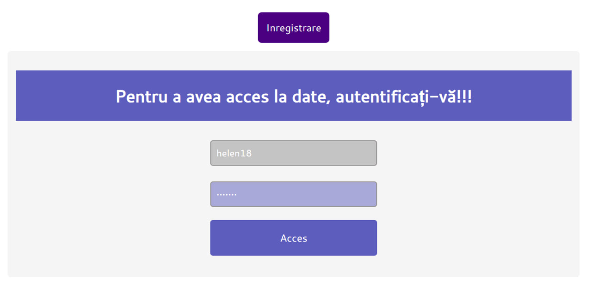
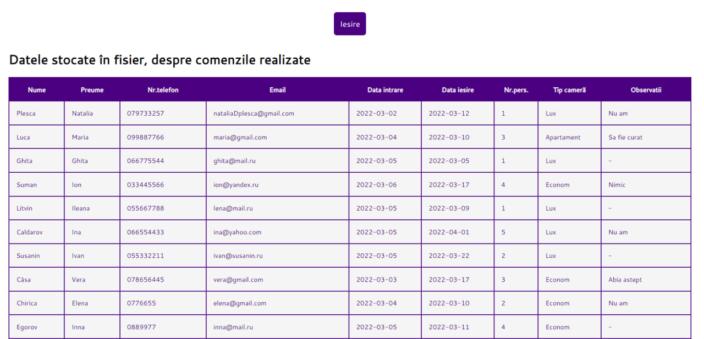

# Лабораторная работа № 7
## Тема: Сессии и переменные типа сессии
### Требования
1.	Добавьте сессию и определите переменные типа сессии в мини-веб-приложении, так чтобы правильно реализовать вход и выход пользователя.
2.	Внимательно проанализируйте представленный в архиве пример.

## Проверка фунциональности веб-приложения и корректной работы сессии
1. Резервация места

2. Проверка добавления резервации в текстовом файле `dateRezervari.txt`

3. Регистрация нового пользователя

4. Проверка добавления нового пользователя в текстовом файле `accounts.txt`

5. Аутентификация

6. Перенаправление на страницу `view_data.php`

7. Проверка созданной резервации в списке

### Примечание

Ввиду того, что в данной лабораторной работе используются сессии и её переменные, то переход по пути `http://localhost/admin/view_data.php` не осуществляется после завершения сессии.

